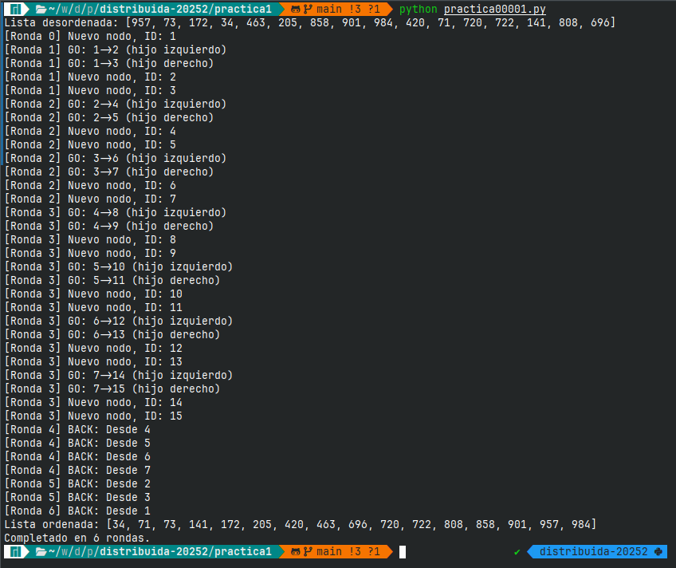

# Desarrollo 

Como SimPy únicamente provee un conjunto de directrices y objetos para abstraer los eventos discretos y el paso del tiempo, el resto del modelaje de la simulación es muy atribrario y se deja completamente a las preferencias o necesidades del desarrollador.

En nuestro caso, hay dos soluciones prágmáticas que se elucidan inmediatamente:

1. **Modelar todo el sistema en un paradigma orientado a objetos**, escribir una clase para modelar a los nodos de la red distribuida, poner métodos para cada operación interna como mezclar u ordenar, para finalmente construir el sistema con instancias de esta y correr la simulación.
2. **Modelar únicamente las partes funcionales del sistema**, es decir, definir únicamente el comportamiento de los nodos con un método el cual se ejecuta y emite salidas que daría un proceso en la red distribuida. No modelamos todos los procesos, sólo lo que hacen. 

Para esta práctica, hemos optado por la segunda opción.

## Modelando el comportamiento de los procesos

Cada proceso en el sistema a modelar sigue la siguiente rutina:

1. Recibe una lista ordenable.
2. Verifica si no es que cumple el caso trivial (que tenga a lo mas 2 elementos).
3. Si es del caso trivial, la ordena trivialmente: Si tiene dos elementos, la voltea por el más grande y regresa la lista. Si tiene uno o ninguno, la regresa tal cual.
4. Si la lista no es trivial, la parte en dos e invoca a otros dos sub-procesos a los que les pasa cada mitad.
5. Espera a obtener las listas ordenadas de sus sub-procesos (que seguirán la misma rutina).
6. Cuando reciban las sub listas ordenadas, las unen en una sola. Esta operación también es trivial, pues sabemos de antemano que las listas están ordenadas, así que basta iterar sobre de ellas a la vez e ir colocando el elemento más grande primero en la lista definitiva.
7. Regresan esta lista y concluyen.

Esta rutina la hemos implementado concretamente en Python del siguiente modo, donde además consideramos que todos los procesos tienen un identificador entero único:

```{.python .numberLines .lineAnchors}
def ordenar(lista: list, id: int):
# PASO 1 al 3
    if len(lista) == 2:
        return lista if lista[0] < lista[1] else lista[::-1]
    elif len(lista) == 1:
        return lista
# PASO 4 
    mitad = len(lista) // 2
    id_hijo_izq = id * 2
    id_hijo_der = id * 2 + 1
# PASO 5 
    lista_izq = ordenar(lista[mitad:], id_hijo_izq) 
    lista_der = ordenar(lista[:mitad], id_hijo_der)
# PASO 6
    lista_ordenada = []
    i, j = 0, 0
    while i < len(lista_izq) and j < len(lista_der):
        if lista_izq[i] <= lista_der[j]:
            lista_ordenada.append(lista_izq[i])
            i += 1
        else:
            lista_ordenada.append(lista_der[j])
            j += 1
    lista_ordenada.extend(lista_izq[i:])
    lista_ordenada.extend(lista_der[j:])
# PASO 7
    print(f"[Ronda {ambiente.now}] BACK: Desde {id}")
    return lista_ordenada
```

## Implementación del sistema síncrono

Con el código anteriormente mostrado, ya seríamos capaces de hacer una ejecución del algoritmo MergeSort en la rutina de ejeución de Python tan solo con una llamada `ordenar(lista, 1)` con cualquier lista ordenable de longitud arbitraria. Los "nodos" se crean sobre demanda de su hipotético padre, formando una topología de árbol binario.

Sin embargo, ahora hace falta implementar el paso del tiempo por rondas en la simulación. Para esto introduciremos un objeto de tipo entorno (`Environment`) de la biblioteca SimPy, que dicho muy alegoricamente, será el "tablero" sobre el cual colocaremos nuestros "nodos", que estarán sujetos al paso del tiempo del mismo mediante eventos de espera `Environment.timeout(1)`. 

Los objetos `Environment` de SimPy tienen una progresión del tiempo que en la documentación es nombrada como "minutos"[@simpy_team_simpy_2024], aunque no son literales minutos como en el tiempo real[^minutos]. Con los eventos de espera `Environment.timeout()` podemos restringir ciertas partes del código para que se ejecuten únicamente cada tanto tiempo simulado.

Dicho todo esto, ahora vamos a comenzar a escribir el *driver code* para nuestra simulación definiendo un entorno
```{.python .numberLines #pddf .lineAnchors}
def main():
    ambiente = simpy.Environment()
    ambiente.run()

```
[^minutos]: Por conveniencia, nosotros nos referiremos en lo subsecuente a estos "minutos" como "rondas"

Nuesto método `ordenar(lista: list, id: int)` previamente definido también será modificado para separar las partes de código que se van a ejecutar dependiendo la ronda. Como podemos recordar a partir de las notas [@riva_palacio_computacion_2024] de clase, durante cada ronda de un sistema distribuido síncrono, un proceso puede recibir mensajes (uno solo por vecino), hacer operaciones computacionales internas con los mensajes obtenidos y generar mensajes para mandarlos a sus vecinos (también, uno solo por vecino).

Asi pues, colocaremos las restricciones `yield ambiente.timeout(1)` como se muestra a continuación. También será necesario introducir un nuevo parámetro en la firma de la función `ordenar` para que cada ejecución sepa sobre que entorno estamos trabajando:

```{.python .numberLines .lineAnchors}
def ordenar(ambiente: simpy.core.Environment, lista: list, id: int):
# PASO 1 al 3
    if len(lista) == 2:
        return lista if lista[0] < lista[1] else lista[::-1]
    elif len(lista) == 1:
        return lista
# PASO 4 
    mitad = len(lista) // 2
    # RESTRICCIÓN DE ESPERA #1
    yield ambiente.timeout(1)
    # La colocamos aquí porque, para este punto del código, 
    # la parte donde cada proceso hace operaciones de cómputo 
    # locales habrá terminado. El código que sigue es de envio
    # de mensajes.
    id_hijo_izq = id * 2
    print(f"[Ronda {ambiente.now}] GO: {id}->{id_hijo_izq} (hijo izquierdo)")
    hi = ambiente.process(ordenar(ambiente, lista[mitad:], id_hijo_izq))
    id_hijo_der = id * 2 + 1
    print(f"[Ronda {ambiente.now}] GO: {id}->{id_hijo_der} (hijo derecho)")
    hd = ambiente.process(ordenar(ambiente, lista[:mitad], id_hijo_der))
# PASO 5 
    # RESTRICCIÓN DE ESPERA #2
    lista_izq, lista_der = (yield hi & hd).values()
    # La colocamos aquí porque el proceso tendrá que esperar 
    # a recibir respuesta de sus hijos. Con la llamada .values() 
    # estamos indicando que esperamos recibir un dato de la 
    # ejecución de los procesos, y no solo esperar a que terminen.
# PASO 6
    lista_ordenada = []
    i, j = 0, 0
    while i < len(lista_izq) and j < len(lista_der):
        if lista_izq[i] <= lista_der[j]:
            lista_ordenada.append(lista_izq[i])
            i += 1
        else:
            lista_ordenada.append(lista_der[j])
            j += 1
    lista_ordenada.extend(lista_izq[i:])
    lista_ordenada.extend(lista_der[j:])
    # RESTRICCIÓN DE ESPERA #3
    yield ambiente.timeout(1)
    # La colocamos aquí porque se trata de las operaciones que 
    # le siguen al recibimiento de mensajes con las listas 
    # ordenadas de los procesos hijos.
# PASO 7
    print(f"[Ronda {ambiente.now}] BACK: Desde {id}")
    return lista_ordenada
```
La palabra reservada `yield` en Python nos permite suspender la ejecución de una función o de determinado ámbito de ejecución y retomarla posteriormente cuando el resultado que se espera con ella esté disponible. En este caso, la usamos para dejar en *stand-by* cada ejecución de la función `ordenar` hasta que las restricciones deseadas se cumplan. En este caso, esa restricción es el tiempo de espera entre rondas, o el recibimiento de mensajes de vuelta.

## Definición de las listas por ordenar

Ahora solo resta definir una lista pseudoaleatoria para ordenar en cada ejecución. Los requerimientos de la práctica indican que esta debe tener 16 elementos numéricos.

Esta parte es muy sencilla de implementar aprovechando el módulo `random` de Python, y la colocaremos directamente en el *driver code* (función `main`) de nuestro programa. Generamos una lísta con 16 elementos pseudoaleatorios entre el 0 y el 1000 y llamamos a `ordenar` con ella.

```{.python .numberLines .lineAnchors}
def main():
    lista = [random.randint(0, 1000) for _ in range(0, 16)]
    print(f"Lista desordenada: {lista}")
    ambiente = simpy.Environment()
    lista_ordenada = ambiente.process(ordenar(ambiente, lista, 1))
    ambiente.run()
```
Con este paso, nuestra simulación de un sistema síncrono que compute MergeSort para una lista arbitraria está completada. Hemos añadido banderas en el método `ordenar` para imprimir en pantalla cada una de las etapas de ejecución y los movimientos que le corresponden. 

# Ejecución

Para ejecutar la simulación, hay que lanzar el script `Practica1_AlejandroAxelRodriguezSanchez_JoseDavidAguilarUribe.py` desde una terminal CLI en un entorno de Python[^version_python] con la biblioteca de SimPy previamente instalada. 

```
python3 Practica1_AlejandroAxelRodriguezSanchez_JoseDavidAguilarUribe.py
```

El programa no espera ninguna entrada del usuario, generará una lista de 16 números pseudoaleatorios y los ordenará empleando MergeSort y mostrando cada una de las rondas en la terminal, tal como se muestra en la Figura 1:

[^version_python]: Para esta actividad se empleó Python 3.12.





[^curso]: 2025-2, Grupo 7106. Profesor: Mauricio Riva Palacio Orozco. Ayudante: Adrián Felipe Fernández Romero. Ayudante de laboratorio: Daniel Michel Tavera.
[^alumno1]: [ahexo@ciencias.unam.mx](mailto:ahexo@ciencias.unam.mx) 
[^alumno2]: [jdu@ciencias.unam.mx](mailto:jdu@ciencias.unam.mx) 

# Referencias
